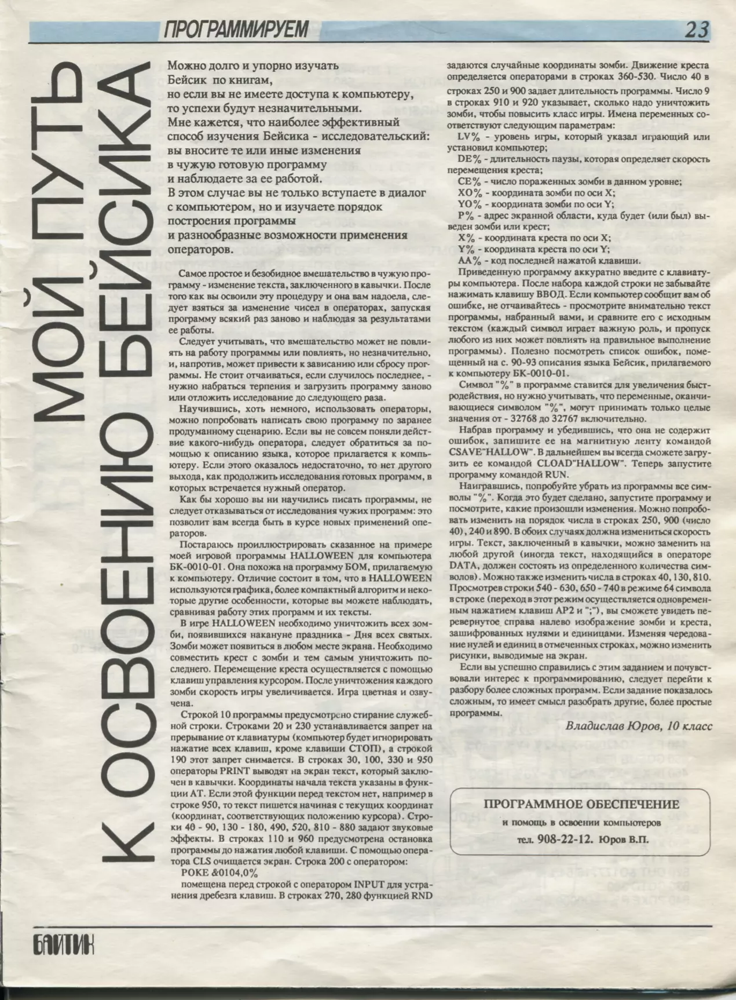
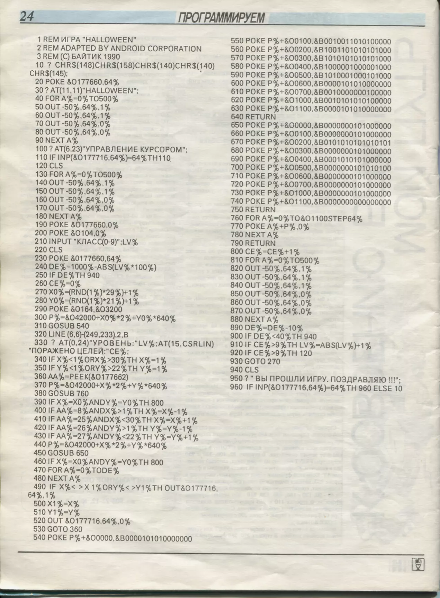

# Halloween game for BK-0010 Soviet home computer

This is type-in game from Bajtik magazine, #1 from 1991

## Description

You move a cross using arrow keys. Zombies appear in random position on screen. 
You kill them by moving cross over them. Game gets faster with each zombie killed.
By killing 10 zombies you advance one level. Game ends when you kill 6th zombie on level 9.

## Original source

## Bugs

I've fixed some typos/bugs:

250 IF DE%<40% TH 940 - original line goes straight to congratulations

920 IF CE%>9% TH 220 - probable typo, line 120 is level select, levels are supposed to increase

## Gameplay

See [video](https://www.youtube.com/watch?v=XP-Ca5uGUAQ).

## Running 

Use emulator from [here](http://gid.pdp-11.ru/).

Put HALLOW.COD to bin folder.

Load with CLOAD "HALLOW"
